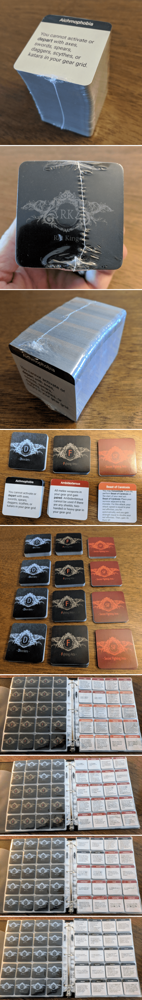

# `KDM-Cards`  
Generate `disorder`, `fighting arts`, `secret fighting arts` and `abilities` cards, to upload to a print on demand service (like printer studio, or make playing cards).  The generated cards are intended to be printed on 2" x 2" side cards.

----

## Setup
* install packages:  
`npm install`

## Requirements
* Chrome web browser (updated to latest version)
* node and npm (install from nodejs.org)
* any static web server (I like "local-web-server": https://www.npmjs.com/package/local-web-server)

## Usage
* run the website:  
`npm run website`  
(http://127.0.0.1:8000/cards.html)

* run the app:  
`node app`

## Example Set of Generated Cards
  
## Demo of Application
  

### JSON Data Sources
* https://github.com/toconnell/kdm-manager/blob/master/v2/api/assets/

----

## Example of Printed Cards

